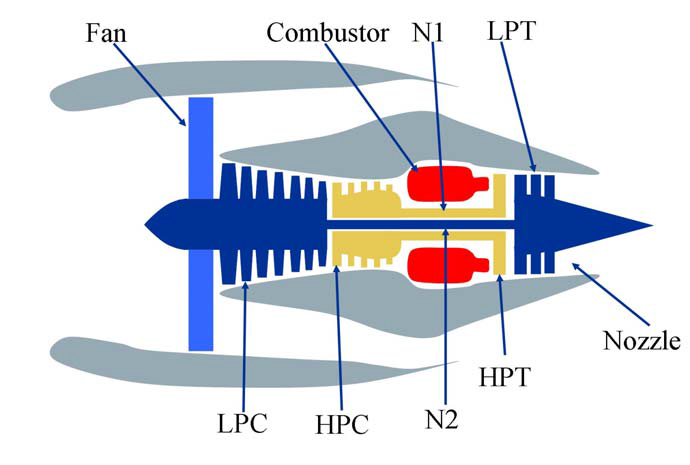

```{r setup, include=FALSE}
knitr::opts_chunk$set(echo = TRUE)
options(scipen=999)
```


| Contribuciones              | Firma           |
| --------------------------  | --------------- |
| Investigación previa        | Fernando Chafim |
| Redacción de las respuestas | Fernando Chafim |
| Desarrollo código           | Fernando Chafim |  

# NASA TURBOFAN JET ENGINE 

We define prognostics here exclusively as the estimation of remaining useful component life. The remaining useful life (RUL) estimates are in units of time (e.g., hours or cycles).

End-of-life can be subjectively determined as a function of operational thresholds that can be measured. These thresholds depend on user specifications to determine safe operational limits.

Prognostics is currently at the core of systems health management. Reliably estimating remaining life holds the promise for considerable cost savings (for example by avoiding unscheduled maintenance and by increasing equipment usage) and operational safety improvements.
Remaining life estimates provide decision makers with information that allows them to change operational characteristics (such as load) which in turn may prolong the life of the component. It also allows planners to account for upcoming maintenance and set in motion a logistics process that supports a smooth transition from faulty equipment to fully functional.

```{r chunck1, echo=TRUE, message=FALSE, warning=FALSE, cache=TRUE}
knitr::include_graphics("img/turbofan1.jpeg")
```

## 2. Dataset

Los pronósticos y la gestión de la salud son un tema importante en la industria para predecir el estado de los activos para evitar tiempos de inactividad y fallas. Este conjunto de datos es la versión de Kaggle del muy conocido conjunto de datos públicos para el modelado de degradación de activos de la NASA. Incluye datos simulados Run-to-Failure de motores a reacción con turboventilador.

La simulación de la degradación del motor se llevó a cabo utilizando C-MAPSS. Se simularon cuatro conjuntos diferentes bajo diferentes combinaciones de condiciones operativas y modos de falla. Registra varios canales de sensores para caracterizar la evolución de la falla. El conjunto de datos fue proporcionado por el CoE de Pronósticos de NASA Ames.

### Descripción

|  Symbol   | Description                           | Units   |
|-----------|---------------------------------------|---------|
| Unit      | -                                     | -       |
| Time      | -                                     | t       |
| Altitude  | Altitude                              | ft      |
| Mach_N    | Mach Number                           |  M      |
| SeaTemp   | Sea Level temperature                 | °F      |
| T2        | Total temperature at **fan** inlet    | °R      |
| T2        | Total temperature at **fan** inlet    | °R      |
| T24       | Total temperature at **LPC** outlet   | °R      |
| T30       | Total temperature at **HPC** outlet   | °R      |
| T50       | Total temperature at **LPT** outlet   | °R      |
| P2        | Pressure at **fan** inlet             | psia    |
| P15       | Total pressure in **bypass-duct**     | psia    |
| P30       | Total pressure at **HPC** outlet      | psia    |
| Nf        | Physical **fan** speed                | rpm     |
| Nc        | Physical **core** speed               | rpm     |
| epr       | Engine pressure ratio (P50/P2)        | --      |
| Ps30      | Static pressure at HPC outlet         | psia    |
| phi       | Ratio of fuel flow to Ps30            | pps/psi |
| NRf       | Corrected fan speed                   | rpm     |
| NRc       | Corrected core speed                  | rpm     |
| BPR       | Bypass Ratio                          | --      |
| farB      |  Burner fuel-air ratio                | --      |
| htBleed   | Bleed Enthalpy                        | --      |
| Nf_dmd    | Demanded fan speed                    | rpm     |
| PCNfR_dmd | Demanded corrected fan speed          | rpm     |
| W31       | HPT coolant bleed                     | lbm/s   |
| W32       | LPT coolant bleed                     | lbm/s   |
| T48       | (EGT) Total temperature at HPT outlet | °R      |
| SmFan     | Fan stall margin                      | --      |
| SmLPC     | LPC stall margin                      | --      |
| SmHPC     | HPC stall margin                      | --      |

```{r chunck2, echo=TRUE, message=FALSE, warning=FALSE, cache=TRUE}

```

### Importancia y objetivos de los análisis

Los pronósticos y la gestión de la salud son un tema importante en la industria para predecir el estado de los activos y evitar tiempos de inactividad y fallas. Este conjunto de datos es la versión de Kaggle del conjunto de datos públicos para el modelado de degradación de activos de la NASA. Incluye datos simulados Run-to-Failure de motores a reacción con turboventilador.

La simulación de la degradación del motor se llevó a cabo utilizando C-MAPSS. Se simularon cuatro conjuntos diferentes bajo diferentes combinaciones de condiciones operativas y modos de fallo. Registra varios canales de sensores para caracterizar la evolución de la falla. El conjunto de datos fue proporcionado por Prognostics CoE en NASA Ames.

En este conjunto de datos, el objetivo es predecir la **vida útil restante (RUL)** de cada motor. La vida útil restante (RUL) es el período de tiempo que es probable que funcione una máquina antes de que requiera reparación o reemplazo. Al tener en cuenta RUL, los ingenieros pueden programar el mantenimiento, optimizar la eficiencia operativa y evitar tiempos de inactividad no planificados. Por esta razón, estimar el RUL es una prioridad máxima en los programas de mantenimiento predictivo.

```{r chunck3, echo=TRUE, message=FALSE, warning=FALSE, cache=TRUE}
knitr::include_graphics("img/turbofan3.jpeg")
```

## 2. Integración y selección de los datos de interés a analizar.

### Integración 

La integración o fusión de los datos consiste en la combinación de datos procedentes de múltiples fuentes, con el fin de crear una estructura de datos coherente y única que contenga mayor cantidad de información.

```{r chunck4, echo=TRUE, message=FALSE, warning=FALSE, cache=TRUE}
library(dplyr)
library(e1071)
library(zeallot)
library(stringr)
library(data.table)
library(DT)
library(DataExplorer)
library(ggcorrplot)
library(plotly)
library(anomalize)
library(zoo)
library(tibbletime)
library(h2o)
library(isofor)
library(boot)
library(mice)
library(ggpubr)
library(MASS)
library(TTR)
library(caret)
library(FNN)
library(dbscan)
library(outliers)
library(car)
```


```{r chunck5, echo=TRUE, message=FALSE, warning=FALSE, cache=TRUE}
trainset <- fread("D:/UOC/Tipología y ciclo de vida de los datos/PRA2/CMaps/train_FD001.txt")
names(trainset) <- c('unit_number', 'time_in_cycles', 'altitude', 'mach_number', 'TRA', 'T2', 'T24', 'T30', 'T50', 'P2', 'P15', 'P30', 'Nf', 'Nc', 'epr', 'Ps30', 'phi', 'NRf', 'NRc', 'BPR', 'farB', 'htBleed', 'Nf_dmd', 'PCNfR_dmd', 'W31', 'W32')
  
testset <- fread("D:/UOC/Tipología y ciclo de vida de los datos/PRA2/CMaps/test_FD001.txt")
names(testset) <- c('unit_number', 'time_in_cycles', 'altitude', 'mach_number', 'TRA', 'T2', 'T24', 'T30', 'T50', 'P2', 'P15', 'P30', 'Nf', 'Nc', 'epr', 'Ps30', 'phi', 'NRf', 'NRc', 'BPR', 'farB', 'htBleed', 'Nf_dmd', 'PCNfR_dmd', 'W31', 'W32')

y_testset <- fread("D:/UOC/Tipología y ciclo de vida de los datos/PRA2/CMaps/RUL_FD001.txt") %>% pull()


read_logs <- function(path = "D:/UOC/Tipología y ciclo de vida de los datos/PRA2/CMaps"){
  
  files <- c("FD001.txt", "FD002.txt", "FD003.txt", "FD004.txt")
  sets <- c("train", "test")
  files <- apply(expand.grid(sets, files), 1, paste, collapse="_")
  f <- file.path(path, files)
  d <- lapply(f, fread)
  names(d) <- str_remove(files, ".txt")
  
  columns = c('unit_number','time_in_cycles','altitude','mach_number','TRA','T2','T24','T30','T50','P2','P15','P30','Nf',
           'Nc','epr','Ps30','phi','NRf','NRc','BPR','farB','htBleed','Nf_dmd','PCNfR_dmd','W31','W32')
  
  temp_func = function(df){
    names(df) <- columns
    return(df)
    }
  
  d <- lapply(d, temp_func)
  
  return(d)
}

#dfs <- read_logs()

#trainset <- bind_rows(
#  dfs$train_FD001#,
  #dfs$train_FD002,
  #dfs$train_FD003,
  #dfs$train_FD004
#  )

#testset <- bind_rows(
#  dfs$test_FD001#,
  #dfs$test_FD002,
  #dfs$test_FD003,
  #dfs$test_FD004
#  )

#trainset$set <- "train"
#testset$set <- "test"

df <- trainset
```

### Selección

##### Features Selection 1

```{r chunck6, echo=TRUE, message=FALSE, warning=FALSE, cache=TRUE}
FindOutliers <- function(x) {
  if(class(x)%in% c("numeric", "integer")){
    lowerq = quantile(x, na.rm = TRUE)[2]
    upperq = quantile(x, na.rm = TRUE)[4]
    iqr = upperq - lowerq #Or use IQR(data)
    # we identify extreme outliers
    extreme.threshold.upper = (iqr * 3) + upperq
    extreme.threshold.lower = lowerq - (iqr * 3)
    result <- which(x > extreme.threshold.upper | x < extreme.threshold.lower)
    output <- length(result)
  } else {
    output <- 0
    }

  return(output)
}

DataProfiling <- function(df){
  
  column_names <- colnames(df)
  column_classes <- as.vector(sapply(df, function(x) class(x)))
  column_mean <- as.vector(sapply(df, function(x) if(class(x)%in% c("numeric", "integer")){mean(x, na.rm = TRUE)} else NA))
  column_sd <- as.vector(sapply(df, function(x) if(class(x)%in% c("numeric", "integer")){sd(x, na.rm = TRUE)} else NA))
  column_median <- as.vector(sapply(df, function(x) if(class(x)%in% c("numeric", "integer")){median(x, na.rm = TRUE)} else NA))
  column_max <- as.vector(sapply(df, function(x) if(class(x)%in% c("numeric", "integer")){max(x, na.rm = TRUE)} else NA))
  column_min <- as.vector(sapply(df, function(x) if(class(x)%in% c("numeric", "integer")){min(x, na.rm = TRUE)} else NA))
  column_nunique <- as.vector(sapply(df, function(x) if(class(x)%in% c("numeric", "integer")){length(unique(x))} else NA))
  column_quantile0   <- as.vector(sapply(df, function(x) if(class(x)%in% c("numeric", "integer")){quantile(x, na.rm = TRUE)[1]} else NA))
  column_quantile25  <- as.vector(sapply(df, function(x) if(class(x)%in% c("numeric", "integer")){quantile(x, na.rm = TRUE)[2]} else NA))
  column_quantile50  <- as.vector(sapply(df, function(x) if(class(x)%in% c("numeric", "integer")){quantile(x, na.rm = TRUE)[3]} else NA))
  column_quantile75  <- as.vector(sapply(df, function(x) if(class(x)%in% c("numeric", "integer")){quantile(x, na.rm = TRUE)[4]} else NA))
  column_quantile100 <- as.vector(sapply(df, function(x) if(class(x)%in% c("numeric", "integer")){quantile(x, na.rm = TRUE)[5]} else NA))
  column_interquartile_range <- as.vector(sapply(df, function(x) if(class(x)%in% c("numeric", "integer")){IQR(x, na.rm = TRUE)} else NA))
  column_skewness <- as.vector(sapply(df, function(x) if(class(x)%in% c("numeric", "integer")){skewness(x, na.rm = TRUE)} else NA))
  column_kurtosis <- as.vector(sapply(df, function(x) if(class(x)%in% c("numeric", "integer")){kurtosis(x, na.rm = TRUE)} else NA))
  column_na <- as.vector(sapply(df, function(x) sum(is.na(x))))
  column_zero <- as.vector(sapply(df, function(x) sum(x==0)))
  column_outliers <- as.vector(sapply(df, FindOutliers))
  
  df_table <- tibble(
    names = column_names, 
    classes = column_classes, 
    min = column_min,
    max = column_max,
    n_unique = column_nunique,
    mean = column_mean,
    sd = column_sd,
    median = column_median,
    quantile_0 = column_quantile0,
    quantile_25 = column_quantile25,
    quantile_50 = column_quantile50,
    quantile_75 = column_quantile75,
    quantile_100 = column_quantile100,
    interquantile_range = column_interquartile_range,
    skewness = column_skewness,
    kurtosis = column_kurtosis,
    MissingValues = column_na,
    n_zero = column_zero,
    Outliers = column_outliers
    )
  
  return(df_table)
  
}

temp <- DataProfiling(df)

```

```{r chunck7, echo=TRUE, message=FALSE, warning=FALSE, cache=TRUE}
unique_columns <- temp$names[temp$n_unique == 1 & !is.na(temp$n_unique)]
print(unique_columns)

df <- df %>% dplyr::select(-one_of(unique_columns))
trainset <- trainset %>% dplyr::select(-one_of(unique_columns))
testset <- testset %>% dplyr::select(-one_of(unique_columns))

```

### Preprocesado de los datos

#### Feature Engineering 1

##### Remaining Useful Life

```{r chunck8, echo=TRUE, message=FALSE, warning=FALSE, cache=TRUE}
add_remaining_useful_life <- function(df){
  
  df <- df %>% 
    group_by(unit_number) %>% 
    mutate(max_time_in_cycles = max(time_in_cycles)) %>%
    ungroup() %>%
    mutate(
      RUL = max_time_in_cycles - time_in_cycles
      ) %>%
    dplyr::select(-max_time_in_cycles)
  
  return(df)
}
```


##### Cumulative terms

```{r chunck9, echo=TRUE, message=FALSE, warning=FALSE, cache=TRUE}
add_cumulative_features <- function(df, columns){
  df <- df %>%
     as_tibble() %>%
     group_by(unit_number) %>%
 mutate(
     across(
       all_of(columns), 
       list(
         cumsum = cumsum,
         cummin = cummin,
         cummax = cummax
         ), 
       .names = "{.fn}_{.col}"
       )
     )
  return(df)
}
```

##### Lag terms

```{r chunck10, echo=TRUE, message=FALSE, warning=FALSE, cache=TRUE}
add_lag <- function(df, columns, num = 1){
  
  for (i in 1:length(num)) {
    num_temp <- num[i]
    df <- df %>%
      as_tibble() %>%
      group_by(unit_number) %>%
      mutate(
        across(all_of(columns), ~lag(.x, n = num_temp, default = NA), .names = paste0("lag", num_temp, "_{.col}"))
        )
  }
  return(df)
}
```

##### Moving Average terms

```{r chunck11, echo=TRUE, message=FALSE, warning=FALSE, cache=TRUE}
add_moving_avg_features <- function(df, columns, num = 5){
  
  for (i in 1:length(num)) {
    num_temp <- num[i]
    df <- df %>%
      as_tibble() %>%
      group_by(unit_number) %>%
      mutate(
        across(
          all_of(columns),
          list(
         rollmean = ~rollapplyr(.x, num_temp, FUN = mean, fill=NA),
         rollsd = ~rollapplyr(.x, num_temp, FUN = sd, fill=NA),
         rolliqr = ~rollapplyr(.x, num_temp, FUN = IQR, fill=NA)
         ),
         .names = paste0("{.fn}", num_temp, "_{.col}")
          )
        )
  }
  return(df)
}

```

##### Interaction terms

```{r chunck12, echo=TRUE, message=FALSE, warning=FALSE, cache=TRUE}
add_interaction_terms <- function(df, columns){
  df_1 <- df %>% dplyr::select(all_of(columns))
  df_2 <- df %>% dplyr::select(!all_of(columns))
  df_interaction <- as.data.frame(model.matrix(~ .^2-1,df_1))
  df_output <- bind_cols(df_2, df_interaction)
  names(df_output) <- gsub(x = names(df_output), pattern = ":", replacement = "_")
  return(df_output)
}
```

##### Todos juntos

```{r chunck13, echo=TRUE, message=FALSE, warning=FALSE, cache=TRUE}
columns <- c("altitude", "mach_number","T24", "T30", "T50", "P15", "P30", "Nf", "Nc", "Ps30", "phi", "NRf",  "NRc", "BPR", "htBleed", "W31", "W32")

trainset2 <- trainset %>%
  add_remaining_useful_life() %>%
  add_interaction_terms(columns) %>% 
  add_lag(columns=columns, num = 1:5) %>% 
  add_moving_avg_features(columns = columns, num = c(3, 5)) %>% 
  add_cumulative_features(columns=columns)

y_trainset <- trainset2$RUL

testset2 <- testset %>%
  add_interaction_terms(columns) %>% 
  add_lag(columns=columns, num = 1:5) %>% 
  add_moving_avg_features(columns = columns, num = c(3, 5)) %>% 
  add_cumulative_features(columns=columns)


```

##### Benchmark

```{r chunck14, echo=TRUE, message=FALSE, warning=FALSE, cache=TRUE}
bechmark_performance <- function(x_train, y_train, x_test, y_test){
  
  df <- bind_cols(x_train, y= y_train)
  model_bench <- lm(y~., data=df)
  
  x_test <- x_test %>% 
             group_by(unit_number) %>%
             filter(time_in_cycles == max(time_in_cycles))
  
  suppressWarnings({
    y_hat <- predict.lm(model_bench, x_test)
  })
  result <- postResample(y_hat, y_test)
  
  return(result)
}

bechmark_performance(x_train = trainset,
                     y_train = y_trainset,
                     x_test = testset,
                     y_test = y_testset)
```

### Análisis estadístico descriptivo

```{r chunck15, echo=TRUE, message=FALSE, warning=FALSE, cache=TRUE}
temp <- DataProfiling(trainset2)

#datatable(temp, class = 'cell-border stripe', rownames = FALSE, filter = 'top', 
#          options = list(
#            pageLength = 10, 
#            autoWidth = TRUE,
#            scrollX = TRUE,
#            scrollY = TRUE
#            )
#          )
knitr::kable(temp, "pipe")
```

```{r chunck16, echo=TRUE, message=FALSE, warning=FALSE, cache=TRUE}
plot_histogram(trainset2)
```

## 3. Limpieza de los datos


3.2. Identificación y tratamiento de valores extremos.

Nuestro dataset no tiene Missing values, pero hay valores extremos. Para 

### 3.1. Missing Values o Ceros

Como tenemos muchas variables, filtramos las variables sin na y generamos un gráfica para conocer las columnas con NA y sus patrones.

```{r chunck17, echo=TRUE, message=FALSE, warning=FALSE, cache=TRUE}
columns_without_na <- colnames(trainset2[, sapply(trainset2, Negate(anyNA)), drop = FALSE])
df_columns_with_na <- trainset2[ , -which(names(trainset2) %in% columns_without_na)]
plot_missing(df_columns_with_na)
```

Como se esperaba, las columnas con lag y roll contienen NAs. Pero esto tiene que ser hasta un time_in_cycles máximo de 5. Vamos a confirmar esto:

```{r chunck18, echo=TRUE, message=FALSE, warning=FALSE, cache=TRUE}
df_columns_with_na$time_in_cycles <- trainset2$time_in_cycles

borra <- df_columns_with_na %>% filter_all(any_vars(is.na(.)))

table(borra$time_in_cycles)
```

Merece la pena hacer algún tipo de imputación de valor?

Para contestar a esta pregunta, vamos a ver si hay alguna máquina en nuestros datos que tenga fallado en este período:

```{r chunck19, echo=TRUE, message=FALSE, warning=FALSE, cache=TRUE}
trainset2 %>% filter(RUL == 0) %>% pull(time_in_cycles) %>% sort() %>% unique()
```

```{r chunck20, echo=TRUE, message=FALSE, warning=FALSE, cache=TRUE}
testset2 %>% 
  group_by(unit_number) %>%
  filter(time_in_cycles == max(time_in_cycles)) %>%
  pull(time_in_cycles) %>% 
  sort() %>% 
  unique()
```

Como se puede ver no existe ninguna necesidad de usar las observaciones de 1 a 5. Por lo tanto, vamos a eliminar estas observaciones con NA sin perder ninguna información importante para nuestro proyecto.

```{r chunck21, echo=TRUE, message=FALSE, warning=FALSE, cache=TRUE}
trainset2 <- trainset2 %>% na.omit()
testset2 <- testset2 %>% na.omit()

plot_missing(trainset2)
```

### 3.2. Identificación y tratamiento de valores extremos


El tratamiento de valores extremos es importante porque estos pueden sesgar / cambiar drásticamente las estimaciones y predicciones de ajuste. Estos datos se encuentran
muy alejados de la distribución normal de una variable o población.

Nuestros datos son basados en simulación de sensores. Esto significa a priori que no hay sospechas de que las observaciones que se desvían tanto del resto fueron generadas mediante un  mecanismo distinto.

Estos datos son legítimos y en princípio no hace falta quitar de nuestra muestra. Pero podemos generar un algorítimo para quitar outliers basada en un criterio univariable y otros multivariable.

Nc	numeric
NRc	numeric	
P15	numeric
Nf	numeric
NRf	numeric
T30	numeric


```{r chunck22, echo=TRUE, message=FALSE, warning=FALSE, cache=TRUE}
remove_outliers <- function(x, na.rm = TRUE, ...) {
  qnt <- quantile(x, probs=c(.25, .75), na.rm = na.rm, ...)
  H <- 1.5 * IQR(x, na.rm = na.rm)
  y <- x
  y[x < (qnt[1] - H)] <- NA
  y[x > (qnt[2] + H)] <- NA
  y
}

temp <- trainset2 %>%
  group_by(time_in_cycles) %>% 
  mutate_at(vars(-group_cols()), remove_outliers)

plot_missing(temp)
```


```{r chunck23, echo=TRUE, message=FALSE, warning=FALSE, cache=TRUE}
columns = c("altitude", "mach_number", "T24", "T30", "T50", "P15", "P30", "Nf", "Nc", "Ps30", "phi", "NRf", "NRc", "BPR", "htBleed", "W31", "W32")


OutlierAnomalyDetection <- function(df, columns = "all", method = "all"){
  if(any(class(df) == "grouped_df")){
    df <- df %>% ungroup()
  }
  if(any(columns == "all")){
    df_temp <- df
  } else {
    df_temp <- df %>% dplyr::select(one_of(columns))
  }
  
  if(method %in% c("all", "cook")){
    mod <- lm(RUL ~., data = df)
    cooksd <- cooks.distance(mod)
    #influential <- as.numeric(names(cooksd)[(cooksd > (4/sample_size))])
    #df <- df[-influential, ]
    df$cook_score <- as.vector(cooksd)
  }
  if(method %in% c("all", "mahalanobis")){
    score <- as.vector(mahalanobis(df_temp, colMeans(df_temp), cov(df_temp)))
    df$mahalanobis_score <- score
  }
  if(method %in% c("all", "PCA")){
    # Cálculo de PCA
    pca <- prcomp(
         x = df_temp,
         center = TRUE,
         scale. = TRUE
       )
    comp <- seq_along(pca$sdev)
    recon <- as.matrix(pca$x[, comp]) %*% t(as.matrix(pca$rotation[, comp]))
    # Se revierte la trasformación centrado y escalado.
    recon <- scale(recon , center = FALSE, scale = 1/pca$scale)
    recon <- scale(recon , center = -1*pca$center, scale = FALSE)
    # Cálculo del error cuadrático medio de recostrucción
    reconstruction_error <- apply(X = (recon - df_temp)^2, MARGIN = 1, FUN = mean)
    # Se añade el error de reconstrucción al dataframe original.
    df$reconstruction_error_pca <- reconstruction_error
  }
  if(method %in% c("all", "knn")){
    # 
    df_scaled <- scale(df_temp)
    df_knn <- get.knn(data = df_scaled, k = 5)
    # Averagedistancetonearestneighbors
    df_score <- rowMeans(df_knn$nn.dist)
    df$knn_score <- df_score
    
  }
  if(method %in% c("all", "dbscan")){
    # 
    df$dbscan_score <- lof(scale(df_temp), k = 5)
    
  }
  #if(method %in% c("all", "oneclasssvm")){
  #  replications = 5
  #  # function to obtain R-Squared from the data
  #  oneclasssvm <- function(data, indices) {
  #    x <- data[indices,] # allows boot to select sample
  #    y <- rep("oneclass", nrow(x))
  #    model <- svm(x,type='one-classification') #train an one-classification model 
  #    # the output is Boolean
  #    pred <- predict(model, x) #create predictions
  #    return(pred)
  #    }
  #  # bootstrapping
  #  results <- boot(
  #    data=df_temp,
  #    statistic=oneclasssvm,
  #    R=replications,
  #    parallel = "multicore",
  #    ncpus = 5
  #    )
  #  temp <- as.data.frame(results$t)
  #  df$oneclasssvm_score <- as.vector(colSums(temp))/replications
  #}
  if(method %in% c("all", "isolationforest")){
    # 
    df_tree <- iForest(X=df_temp, nt = 100)
    # Scores near 1 indicate anomalies (small path length)
    df_score <- predict(df_tree, newdata = df_temp)
    df$isolationforest_score <- df_score
    
  }
  if(method %in% c("all", "autoencoder")){
    h2o.init(ip = "localhost",
         # Si emplea un único core los resultados son reproducibles.
         # Si se dispone de muchos datos, mejor emplear varios cores.
         nthreads = 1
         )
    # Se eliminan los datos del cluster por si ya había sido iniciado.
    h2o.removeAll()
    h2o.no_progress()
    df_h2o <- as.h2o(
                x = df_temp,
                destination_frame = "df_h2o"
             )
    # División de las observaciones en conjunto de entrenamiento y validación.
    df_h2o_split <- h2o.splitFrame(data = df_h2o, ratios = 0.8, seed = 123)
    df_h2o_train <- df_h2o_split[[1]]
    df_h2o_validacion <- df_h2o_split[[2]]
    # Se define la variables empleadas por el autoencoder
    predictores  <- setdiff(h2o.colnames(df_h2o), "y")
    # Entrenamiento del modelo autoencoder con 2 neuronas en la capa oculta.
    autoencoder <- h2o.deeplearning(
      x = predictores,
      training_frame   = df_h2o_train,
      validation_frame = df_h2o_validacion,
      activation     = "Tanh",
      autoencoder    = TRUE,
      hidden         = c(2),
      epochs         = 50,
      ignore_const_cols    = FALSE,
      score_each_iteration = TRUE,
      # Seed solo válido cuando se emplea un único core
      seed = 999
      )
    
    reconstruction_error <- h2o.anomaly(
                          object = autoencoder,
                          data   = df_h2o[, predictores],
                          per_feature = FALSE
                        )
    reconstruction_error <- as.data.frame(reconstruction_error)
    reconstruction_error <- reconstruction_error[, 1]
    # Se añade el error de reconstrucción al dataframe original.
    df$anomaly_score_autoencoder <- reconstruction_error
    
  }
  
  return(df)
}

temp <- OutlierAnomalyDetection(df = trainset2, columns, method = "all")
```

```{r chunck24, echo=TRUE, message=FALSE, warning=FALSE, cache=TRUE}
df_temp <- temp %>% ungroup() %>% dplyr::select(cook_score, mahalanobis_score, reconstruction_error_pca,  knn_score, dbscan_score, isolationforest_score, anomaly_score_autoencoder, RUL)


# Compute a correlation matrix
corr <- round(cor(df_temp), 1)
# Compute a matrix of correlation p-values
p.mat <- cor_pmat(df_temp)

# Visualize the lower triangle of the correlation matrix
# Barring the no significant coefficient
corr.plot <- ggcorrplot(
  corr, hc.order = TRUE, type = "lower", lab = TRUE, outline.col = "white",
  p.mat = p.mat
  )

corr.plot
```


```{r chunck25, echo=TRUE, message=FALSE, warning=FALSE, cache=TRUE}
# Distribución del error de reconstrucción.
tibble(df_temp) %>%
  ggplot(aes(x = cook_score)) +
  geom_density(fill = "steelblue") +
  labs(title = "Distribución de las medidas de la Distancia de Cook",
       x = "Error de reconstrucción") +
  theme_bw()
```

Según la distribución de la distancia de Cook, podemos ver claramente que existen outliers en los valores más grandes.

```{r chunck26, echo=TRUE, message=FALSE, warning=FALSE, cache=TRUE}
ggplot(data = df_temp, aes(x = "", y = cook_score)) + 
  geom_boxplot() #+
#  coord_cartesian(ylim = c(0, 150)) # I set the y axis scale so the plot looks better.
```

Podemos aplicar la prueba de Grubbs. La prueba de Grubbs detecta un valor atípico a la vez (valor más alto o más bajo), por lo que las hipótesis nula y alternativa son las siguientes:

* $H_0$: El valor más alto **no** es un outlier
* $H_1$: El valor más alto es un outlier

El valor de p < 0,05 significa que al nivel de significancia del 5%, rechazamos la hipótesis de que el valor más no es un valor atípico.

Abajo generamos un loop dónde evaluamos en cada turno el valor más grande, si es outliers, se lo eliminamos y aplicamos otra vez la prueba hasta que no exista ningún outlier según Grubbs.

```{r chunck27, echo=TRUE, message=FALSE, warning=FALSE, cache=TRUE}
actual_p_value <- 0
p_value <- 0.05
outliers <- c()
df_no_cook_outlier <- df_temp

while (actual_p_value < p_value) {
  
  grubbs_test <- grubbs.test(df_no_cook_outlier$cook_score)
  actual_p_value <- grubbs_test$p.value
  value <- gsub(pattern = "highest value ", "", x = grubbs_test$alternative)
  value <- as.numeric(gsub(pattern = " is an outlier", "", x = value))
  outliers <- c(outliers, value)
  if(actual_p_value < p_value){
    df_no_cook_outlier <- df_no_cook_outlier %>% filter(cook_score < max(cook_score))
    #print(max(df_no_cook_outlier$cook_score))
    #print(paste0("The value ", value, " is an outlier and it's been removed."))
  } else {
    break
  }
  
}


tibble(df_no_cook_outlier) %>%
  ggplot(aes(x = cook_score)) +
  geom_density(fill = "steelblue") +
  labs(title = "Distribución de las medidas de la Distancia de Cook",
       x = "Error de reconstrucción") +
  theme_bw()
```


```{r chunck28, echo=TRUE, message=FALSE, warning=FALSE, cache=TRUE}
# Distribución del error de reconstrucción.
tibble(df_temp) %>%
  ggplot(aes(x = mahalanobis_score)) +
  geom_density(fill = "steelblue") +
  labs(title = "Distribución de las medidas de la Distancia de Mahalanobis",
       x = "Error de reconstrucción") +
  theme_bw()
```

```{r chunck29, echo=TRUE, message=FALSE, warning=FALSE, cache=TRUE}
# Distribución del error de reconstrucción.
tibble(df_temp) %>%
  ggplot(aes(x = reconstruction_error_pca)) +
  geom_density(fill = "steelblue") +
  labs(title = "Distribución del error de reconstrucción de PCA",
       x = "Error de reconstrucción") +
  theme_bw()
```

```{r chunck30, echo=TRUE, message=FALSE, warning=FALSE, cache=TRUE}
# Distribución del error de reconstrucción.
tibble(df_temp) %>%
  ggplot(aes(x = knn_score)) +
  geom_density(fill = "steelblue") +
  labs(title = "Distance based Outlier Detection",
       x = "Error de reconstrucción") +
  theme_bw()
```


```{r chunck31, echo=TRUE, message=FALSE, warning=FALSE, cache=TRUE}
# Distribución del error de reconstrucción.
tibble(df_temp) %>%
  ggplot(aes(x = dbscan_score)) +
  geom_density(fill = "steelblue") +
  labs(title = "Density based Outlier Detection",
       x = "Error de reconstrucción") +
  theme_bw()
```

```{r chunck32, echo=TRUE, message=FALSE, warning=FALSE, cache=TRUE}
# Distribución del error de reconstrucción.
tibble(df_temp) %>%
  ggplot(aes(x = isolationforest_score)) +
  geom_density(fill = "steelblue") +
  labs(title = "Bagging of trees based Outlier Detection",
       x = "Error de reconstrucción") +
  theme_bw()
```

```{r chunck33, echo=TRUE, message=FALSE, warning=FALSE, cache=TRUE}
# Distribución del error de reconstrucción.
tibble(df_temp) %>%
  ggplot(aes(x = anomaly_score_autoencoder)) +
  geom_density(fill = "steelblue") +
  labs(title = "Deep Learning based Outlier Detection",
       x = "Error de reconstrucción") +
  theme_bw()
```


## 4. Análisis de los datos

### 4.1. Selección de los grupos de datos que se quieren analizar/comparar (planificación de los análisis a aplicar).

Nuestro análisis se centrará en las máquinas cuando estas fallaron (RUL = 0). Además vamos a examinar dos grupos distintos, uno son las máquinas que fallaron con menos de 200 vuelos y el otro grupo son las máquinas con 200 o más vuelos.


```{r chunck34, echo=TRUE, message=FALSE, warning=FALSE, cache=TRUE}
df <- trainset2 %>%
  ungroup() %>%
  filter(RUL == 0) %>%
  mutate(
    label = if_else(time_in_cycles < 200, "bad", "good")
  ) %>%
  dplyr::select(-RUL, -time_in_cycles, -unit_number)
  


table(df$label)
```

```{r chunck35, echo=TRUE, message=FALSE, warning=FALSE, cache=TRUE}
temp <- DataProfiling(df)

unique_columns <- temp$names[temp$n_unique == 1 & !is.na(temp$n_unique)]
print(unique_columns)

df <- df %>% dplyr::select(-one_of(unique_columns))
```

```{r chunck36, echo=TRUE, message=FALSE, warning=FALSE, cache=TRUE}
plot_boxplot(df, by = "label")
```

### 4.2 Comprobación de la normalidad y homogeneidad de la varianza.

Primero, vamos a examinar si los datos siguen una distribución normal, 

```{r chunck37, echo=TRUE, message=FALSE, warning=FALSE, cache=TRUE}
normalityChecker <- function(df){
  df$label = NULL
  result <- data.frame(variables = names(df), p_value = NA, result = NA)
  
  for (i in 1:nrow(result)) {
    variable <- df[,i]
    prueba <- shapiro.test(pull(variable))
    result$p_value[i] <- prueba$p.value
    result$result[i] <- if_else(prueba$p.value >= 0.05, "normally distributed", "not normally distributed") 
    
  }
  
  return(result)
}

pruebas <- normalityChecker(df)

table(pruebas$result)
```

Ahora vamos a examinar la homocedasticidad. 

Para las variables que siguen una distribución normal usaremos el **test de Levene** y el **test de Fligner-Killeen** para las columnas que no cumplen con la condición de normalidad.

```{r chunck38, echo=TRUE, message=FALSE, warning=FALSE, cache=TRUE}
homoscedasticityChecker <- function(df_in, normalitychecker_table){
  group = as.factor(df_in$label)
  df_in$label = NULL
  names(normalitychecker_table) <- c("variables", "normal_p_value", "normal_result")
  normalitychecker_table$homoscedasticity_p_value = NA
  normalitychecker_table$homoscedasticity_result = NA
  
  for (i in 1:nrow(normalitychecker_table)) {
    y <- pull(df_in[,i])
    temp_df <- data.frame(y = y, group = group)
    
    if(normalitychecker_table[i,3] == "normally distributed"){
      result_test <- leveneTest(y = y, group = group, data = temp_df)
      p_value = result_test$`Pr(>F)`[1]
    } else {
      result_test <- fligner.test(x = y, g = group, data = temp_df)
      p_value = result_test$p.value
    }
    normalitychecker_table$homoscedasticity_p_value[i] = p_value
    normalitychecker_table$homoscedasticity_result[i] = if_else(p_value < 0.05, "statistically different variances", "not statistically different variances")
  }
  return(normalitychecker_table)
}

pruebas2 <- homoscedasticityChecker(df = df, normalitychecker_table = pruebas)

table(pruebas2$homoscedasticity_result)
```


```{r chunck39, echo=TRUE, message=FALSE, warning=FALSE, cache=TRUE}
table(pruebas2$normal_result, pruebas2$homoscedasticity_result)
```


### 4.3 Aplicación de pruebas estadísticas para comparar los grupos de datos.

Queremos saber si el promedio de nuestra variables para el grupo de máquinas buenas ($m_A$) es significativamente diferente al de las máquinas malas ($m_B$).

En este caso, tenemos dos grupos de muestras no relacionados (es decir, independientes o no apareados). Por lo tanto, es posible utilizar una prueba t independiente para evaluar si las medias son diferentes.

```{r chunck40, echo=TRUE, message=FALSE, warning=FALSE, cache=TRUE}
significantDifferenceChecker <- function(df_in, normalitychecker_table){
  
  group = as.factor(df_in$label)
  df_in$label = NULL
  normalitychecker_table$mean_difference_p_value = NA
  normalitychecker_table$mean_difference_result = NA
  
  for (i in 1:nrow(normalitychecker_table)) {
    y <- pull(df_in[,i])
    temp_df <- data.frame(y = y, group = group)
    
    if(normalitychecker_table[i,3] == "normally distributed" & normalitychecker_table[i,5] == "statistically different variances") {
      result_test <- t.test(x = temp_df$y[group == "good"], y = temp_df$y[group == "bad"])
    } else {
      result_test <- wilcox.test(x = temp_df$y[group == "good"], y = temp_df$y[group == "bad"])
    }
    
    normalitychecker_table$mean_difference_p_value[i] = result_test$p.value
    normalitychecker_table$mean_difference_result[i] = if_else(result_test$p.value < 0.05, "statistically different means", "not statistically different means")
  }
  
  return(normalitychecker_table)
}

pruebas3 <- significantDifferenceChecker(df_in = df, normalitychecker_table = pruebas2)

table(pruebas3$mean_difference_result)
```


```{r chunck41, echo=TRUE, message=FALSE, warning=FALSE, cache=TRUE}
columns_significant <- pruebas3 %>% filter(mean_difference_result == "statistically different means") %>% pull(variables)

plot_boxplot(df[,c(columns_significant,"label")], by = "label")
```

Ahora vamos a estudiar el problema de multicolinealidad o de cuando dos variables son altamente correlacionadas, al punto de ser una combinación lineal. Además, examinaremos si la correlación es significativamente diferente de cero. Usaremos la prueba de Spearman porque gran parte de las variables no son normalmente distribuídas.

```{r chunck42, echo=TRUE, message=FALSE, warning=FALSE, cache=TRUE}
df_temp <- df[,columns_significant]


# Compute a correlation matrix
corr <- round(cor(df_temp), 1)
# Compute a matrix of correlation p-values
p.mat <- cor_pmat(df_temp, method="spearman")

# Visualize the lower triangle of the correlation matrix
# Barring the no significant coefficient
corr.plot <- ggcorrplot(
  corr, hc.order = TRUE, type = "lower", lab = TRUE, outline.col = "white",
  p.mat = p.mat
  )

corr.plot
```

El resultado indica que hay muchas correlaciones que no son estadísticamente diferente de cero y, por otro lado, algunas variables son combinación lineales. Este última condición sería un problema en un modelo de regresión lineal.


```{r chunck43, echo=TRUE, message=FALSE, warning=FALSE, cache=TRUE}
df_temp <- df[,c(columns_significant[!grepl('cumsum', columns_significant)], "label")]
df_temp$label <- as.factor(df_temp$label)

model <- glm(label ~., data = df_temp, family = binomial) %>%
  stepAIC(trace = FALSE)

# Summarize the final selected model
summary(model)
```

Hemos usado una selección de variable paso a paso basada en el criterio de información de akaike. Un modelo con un AIC bajo se caracteriza por una baja complejidad (minimiza p) y un buen ajuste. Las variables más importantes para explicar si una máquina tiene buen o malo rendimiento son:

* T30_BPR            
* lag2_mach_number 
* lag3_T30            
* rollsd3_W31      
* rolliqr3_W31     
* rollsd5_Nf        
* rollsd5_phi       
* cummin_T30         
* cummax_phi         
* cummin_htBleed 

## 5. Representación de los resultados a partir de tablas y gráficas.


```{r chunck44, echo=TRUE, message=FALSE, warning=FALSE, cache=TRUE}
oldpar <- par(oma = c(0, 0, 3, 0), mfrow = c(2, 2))
plot(model)
```

Vemos el intervalo de confianza de los parametros.

```{r chunck46, echo=TRUE, message=FALSE, warning=FALSE, cache=TRUE}
confint(model, level = 0.95)
```

```{r chunck47, echo=TRUE, message=FALSE, warning=FALSE, cache=TRUE}
pred <-  as.factor(round(predict(model, newdata = df_temp, type="response"),0))

observaciones <- as.factor(if_else(df$label=="bad", 0, 1))

matriz <- confusionMatrix(observaciones, pred)
matriz
```


## 6. Resolución del problema. A partir de los resultados obtenidos, ¿cuáles son las
conclusiones? ¿Los resultados permiten responder al problema?

Nuestra conclusión es que la información contenida en las variables:
lag2_mach_number 
lag3_T30           
rollsd3_W31      
rolliqr3_W31       
rollsd5_Nf        
rollsd5_phi       
cummin_T30        
cummax_phi         
cummin_htBleed 

Consigue explicar un 75% sobre cuando una máquina tendrá una vida larga o corta.
Nuestro sample size es de 100 máquinas, nuestro modelo es lineal y predecimos sobre el mismo dato usado en el entrenamiento, lo que puede causar overfitting (parcialmente ignorado porque regresión logistica es bastante limitada en generar overfitting).

Este resultado no responde realmente el problema sobre los factores que determinan una vida larga en las máquinas, pero sirve para indicar factores importantes que pueden ser explorados con nuevas variables, modelos más potentes y diferentes "problem framings".

Futuramente continuaremos esta investigación con los otros datasets y tres "problem framings" distintos:

* (1) Como un problema de clasificación para predecir el riesgo de la máquina fallar en su siguiente ciclo;

* (2) Un análisis de supervivencia;

* (3) Un modelos de regresión para prededir el **Remaining Useful Life** 


