# Prognostic-of-NASA-Turbofan-Jet-Engine

Caso práctico para la asignatura **Tipologia y ciclo de vida de los datos** (Master Data Science - UOC) orientado a aprender a identificar los datos relevantes para un proyecto analítico y usar las herramientas de integración, limpieza, validación y análisis.

Tabla de Contenido
=================
<!--ts-->
   * [0. Introducción](#0---introducción)
   * [1. Dataset](#1---dataset)
      * [1.1 Descripción](#1.1---descripción)
      * [1.2 Importancia y objetivo](#1.2---importancia-y-objetivo)
   * [2. Integración y selección](#2---integración-y-selección)
      * [2.1 Integración](#2.1---integración)
      * [2.2 Selección](#2.2---selección)
      * [2.3 Preprocesado de los datos](#2.3---preprocesado-de-los-datos)
      * [2.4 Análisis estadístico descriptivo](#2.4---análisis-estadístico-descriptivo)
   * [3. Limpieza de los datos](#3---limpieza-de-los-datos)
      * [3.1 Missing Values o Ceros](#3.1---missing-values-o-ceros)
      * [3.2 Identificación y tratamiento de valores extremos](#3.2---identificación-y-tratamiento-de-valores-extremos)
   * [4. Análisis de los datos](#4---análisis-de-los-datos)
      * [4.1 Selección de los grupos de datos que se quieren comparar](#4.1---selección-de-los-grupos-de-datos-que-se-quieren-comparar)
      * [4.2 Comprobación de la normalidad y homogeneidad de la varianza](#4.2---comprobación-de-la-normalidad-y-homogeneidad-de-la-varianza)
      * [4.3 Aplicación de pruebas estadísticas para comparar los grupos de datos](#4.3---aplicación-de-pruebas-estadísticas-para-comparar-los-grupos-de-datos)
   * [5. Aplicación de pruebas estadísticas para comparar los grupos de datos](#5---aplicación-de-pruebas-estadísticas-para-comparar-los-grupos-de-datos)
   * [6. Resolución del problema](#6---resolución-del-problema)
<!--te-->

0 - Introducción
============

Aquí definimos los pronósticos exclusivamente como la estimación de la vida útil restante del componente. Las estimaciones de vida útil restante (RUL) están en unidades de tiempo (ciclos).

El final de la vida útil se puede determinar subjetivamente en función de los umbrales operativos que se pueden medir. Estos umbrales dependen de las especificaciones del usuario para determinar los límites operativos seguros.
Nuestro estudio estará centrado en estudiar los condicionantes de los limites del componente.

El pronóstico es actualmente el núcleo de la gestión de la salud de los sistemas. La estimación confiable de la vida restante promete ahorros considerables en los costos (por ejemplo, evitando el mantenimiento no programado y aumentando el uso del equipo) y mejoras en la seguridad operativa.
Las estimaciones de vida útil restante proporcionan a los tomadores de decisiones información que les permite cambiar las características operativas (como la carga), lo que a su vez puede prolongar la vida útil del componente. También permite a los planificadores tener en cuenta el próximo mantenimiento y poner en marcha un proceso logístico que respalde una transición sin problemas de equipos defectuosos a completamente funcionales.

1 - Dataset
============

https://www.kaggle.com/behrad3d/nasa-cmaps

"Los pronósticos y la gestión de la salud son un tema importante en la industria para predecir el estado de los activos para evitar tiempos de inactividad y fallas. Este conjunto de datos es la versión de Kaggle del muy conocido conjunto de datos públicos para el modelado de degradación de activos de la NASA. Incluye datos simulados Run-to-Failure de motores a reacción con turboventilador.

La simulación de la degradación del motor se llevó a cabo utilizando C-MAPSS. Se simularon cuatro conjuntos diferentes bajo diferentes combinaciones de condiciones operativas y modos de falla. Registra varios canales de sensores para caracterizar la evolución de la falla. El conjunto de datos fue proporcionado por el CoE de Pronósticos de NASA Ames.

Los pronósticos basados ​​en datos enfrentan el desafío perenne de la falta de conjuntos de datos de ejecución hasta fallar. En la mayoría de los casos, los datos del mundo real contienen firmas de fallas para una falla creciente, pero poca o ninguna captura de datos sobre la evolución de la falla hasta la falla. 

La obtención de datos reales de progresión de fallas del sistema suele requerir mucho tiempo y dinero. La mayoría de las veces, los sistemas de campo no están debidamente instrumentados para la recopilación de datos relevantes. Aquellos que tienen la suerte de poder recopilar datos a largo plazo para flotas de sistemas tienden, comprensiblemente, a conservar los datos de la divulgación pública por razones de propiedad o competitivas.

Este dataset fue generado por C-MAPSS, un modelo de simulación que incluye una serie de parámetros de entrada editables que permiten al usuario ingresar valores específicos de su propia elección con respecto al perfil operativo, controladores de circuito cerrado, condiciones ambientales, etc.

1.1 - Descripción
----------------------------------

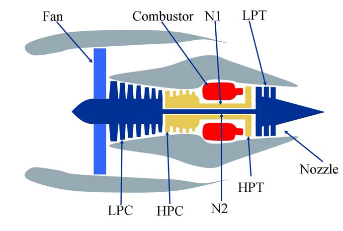

Nuestro diccionário de datos:

|  Symbol   | Description                           | Units   |
|-----------|---------------------------------------|---------|
| Unit      | -                                     | -       |
| Time      | -                                     | t       |
| Altitude  | Altitude                              | ft      |
| Mach_N    | Mach Number                           |  M      |
| SeaTemp   | Sea Level temperature                 | °F      |
| T2        | Total temperature at **fan** inlet    | °R      |
| T2        | Total temperature at **fan** inlet    | °R      |
| T24       | Total temperature at **LPC** outlet   | °R      |
| T30       | Total temperature at **HPC** outlet   | °R      |
| T50       | Total temperature at **LPT** outlet   | °R      |
| P2        | Pressure at **fan** inlet             | psia    |
| P15       | Total pressure in **bypass-duct**     | psia    |
| P30       | Total pressure at **HPC** outlet      | psia    |
| Nf        | Physical **fan** speed                | rpm     |
| Nc        | Physical **core** speed               | rpm     |
| epr       | Engine pressure ratio (P50/P2)        | --      |
| Ps30      | Static pressure at HPC outlet         | psia    |
| phi       | Ratio of fuel flow to Ps30            | pps/psi |
| NRf       | Corrected fan speed                   | rpm     |
| NRc       | Corrected core speed                  | rpm     |
| BPR       | Bypass Ratio                          | --      |
| farB      |  Burner fuel-air ratio                | --      |
| htBleed   | Bleed Enthalpy                        | --      |
| Nf_dmd    | Demanded fan speed                    | rpm     |
| PCNfR_dmd | Demanded corrected fan speed          | rpm     |
| W31       | HPT coolant bleed                     | lbm/s   |
| W32       | LPT coolant bleed                     | lbm/s   |
| T48       | (EGT) Total temperature at HPT outlet | °R      |
| SmFan     | Fan stall margin                      | --      |
| SmLPC     | LPC stall margin                      | --      |
| SmHPC     | HPC stall margin                      | --      |

1.2 - Importancia y objetivo
----------------------------------

Los pronósticos y la gestión de la salud son un tema importante en la industria para predecir el estado de los activos y evitar tiempos de inactividad y fallas. Este conjunto de datos es la versión de Kaggle del conjunto de datos públicos para el modelado de degradación de activos de la NASA. Incluye datos simulados Run-to-Failure de motores a reacción con turboventilador.

La simulación de la degradación del motor se llevó a cabo utilizando C-MAPSS. Se simularon cuatro conjuntos diferentes bajo diferentes combinaciones de condiciones operativas y modos de fallo. Registra varios canales de sensores para caracterizar la evolución de la falla. El conjunto de datos fue proporcionado por Prognostics CoE en NASA Ames.

En este conjunto de datos, el objetivo es predecir la **vida útil restante (RUL)** de cada motor. La vida útil restante (RUL) es el período de tiempo que es probable que funcione una máquina antes de que requiera reparación o reemplazo. Al tener en cuenta RUL, los ingenieros pueden programar el mantenimiento, optimizar la eficiencia operativa y evitar tiempos de inactividad no planificados. Por esta razón, estimar el RUL es una prioridad máxima en los programas de mantenimiento predictivo.

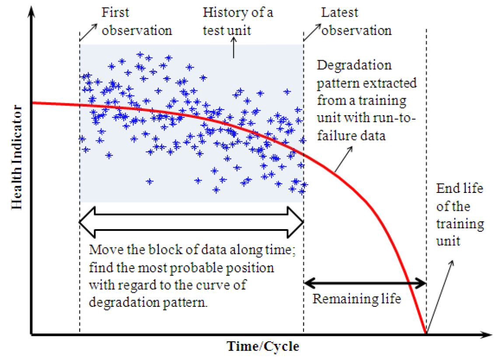

2 - Integración y selección
============

2.1 - Integración
----------------------------------

La integración o fusión de los datos consiste en la combinación de datos procedentes de múltiples fuentes, con el fin de crear una estructura de datos coherente y única que contenga mayor cantidad de información.

2.2 - Selección
----------------------------------

Seleccionamos: 

* (1) Variables no unicas;
* (2) Observaciones sobre máquinas en su fin de vida. (Elinamos más adelante porque necesitamos de las otras observaciones para generar nuevas variables) 

2.3 - Preprocesado de los datos
----------------------------------

En esta estapa realizamos ingeneria de características, dónde generamos más de 300 variables agrupadas en:

* (1) Remaning Useful Life
* (2) Cumulative terms
* (3) Lag terms
* (4) Moving Average terms
* (5) Interaction terms

2.4 - Análisis estadístico descriptivo
----------------------------------

En esta etapa examinamos la distribución de las variables y sus: 
* (1) clases; 
* (2) min-max; 
* (3) total de valores únicos; 
* (4) mean/standard deviation/median; 
* (5) Quantiles 0%, 25%, 50%, 75%, 100%;
* (6) interquantile range; 
* (7) Skewness; 
* (8) Kurtosis; 
* (9) Missing values; 
* (10) total de ceros; 
* (11) total de outliers univariados.

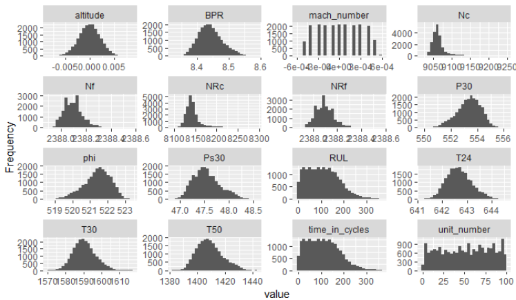

3 - Limpieza de los datos
============

3.1 - Missing Values o Ceros
----------------------------------

Nuestro estudio sobre los missing values consiste en (1) identificar cuales observaciones tienen y (2) proponer la mejor solución para nuestro estudio.

Como tenemos muchas variables, filtramos las variables sin na y generamos un gráfica para conocer las columnas con NA y sus patrones.

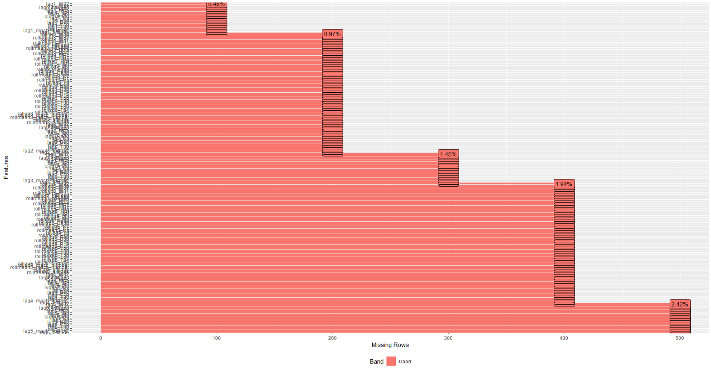

Como se esperaba, las columnas con lag y roll contienen NAs. Pero esto tiene que ser hasta un time_in_cycles máximo de 5.

Merece la pena hacer algún tipo de imputación de valor?

Para contestar a esta pregunta, vimos si hay alguna máquina en nuestros datos que tenga fallado en este período y comprobamos que no hay. No existe ninguna necesidad de usar las observaciones de 1 a 5 porque vamos a seleccionar apenas variables en fin de ciclo. Por lo tanto, vamos a eliminar estas observaciones con NA sin perder ninguna información importante para nuestro proyecto.

3.2 - Identificación y tratamiento de valores extremos
----------------------------------

El tratamiento de valores extremos es importante porque estos pueden sesgar / cambiar drásticamente las estimaciones y predicciones de ajuste. Estos datos se encuentran muy alejados de la distribución normal de una variable o población.

Nuestros datos son basados en simulación de sensores. Esto significa a priori que no hay sospechas de que las observaciones que se desvían tanto del resto fueron generadas mediante un  mecanismo distinto.

Estos datos son legítimos y en princípio no hace falta quitar de nuestra muestra. Pero podemos generar un algorítimo para quitar outliers.

Nuestra actividad entre esta sección es:

* (1) Generar una algoritmo que identifica outliers basado en el método clasico univariado;

* (2) Generar otro algoritmo crea una nueva variable/score que puede ser usada para identificar outliers multivariado. Los métodos usados son:
    * 2.1 - **Distancia de Cook**;
    * 2.2 - **Distancia de Mahalanobis**;
    * 2.3 - **Análisis de componentes principales**;
    * 2.4 - **k vecinos más cercanos**;
    * 2.5 - **Density-based spatial clustering**;
    * 2.6 - **One Class Support Vector Machines**;
    * 2.7 - **Isolation Forest**;
    * 2.8 - **Deep Autoencoder**;

Examinamos su correlación y aplicamos una prueba de correlation para verificar la hipótesis de que la correlación sea diferente de cero.

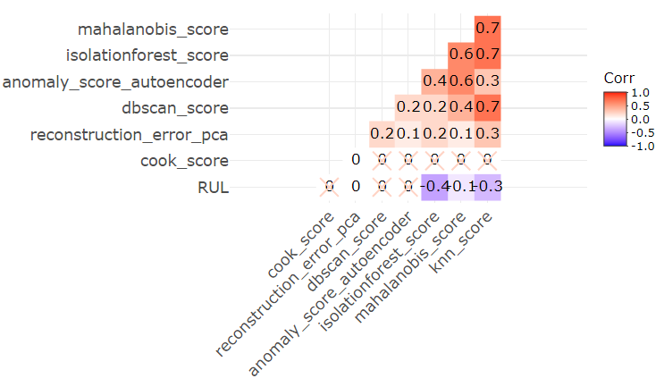

* (3) Generamos un algoritmo para aplicar la prueba de Grubbs de manera iterativa simpre considerando el valor más extremo. O sea, en la iteración 1, hacemos la prueba para el valor extremo, si este valor es significativamente un outlier, se lo eliminamos y aplicamos la prueba otra vez al nueva valor extremo. El algoritmo para cuando no hay más valor extremo en la punta.

4 - Análisis de los datos
============

4.1 - Selección de los grupos de datos que se quieren comparar
----------------------------------

Nuestro análisis se centrará en las máquinas cuando estas fallaron (RUL = 0). Además vamos a examinar dos grupos distintos, uno son las máquinas que fallaron con menos de 200 vuelos (**bad**) y el otro grupo son las máquinas con 200 o más vuelos (**good**).

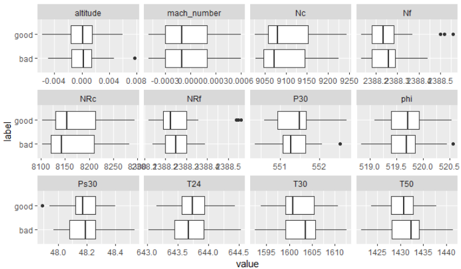

4.2 - Comprobación de la normalidad y homogeneidad de la varianza
----------------------------------

Primero, generamos un algoritmo que usa la **prueba de Shapiro-Wilk** para examinar si cada variable sigue la distribución normal.

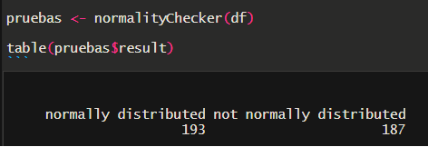

Ahora vamos a examinar la homocedasticidad. 

Para las variables que siguen una distribución normal usaremos el **test de Levene** y el **test de Fligner-Killeen** para las columnas que no cumplen con la condición de normalidad.

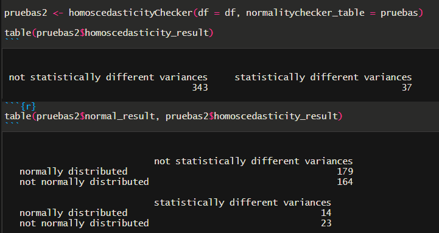

4.3 - Aplicación de pruebas estadísticas para comparar los grupos de datos
----------------------------------

Queremos saber si el promedio de nuestra variables para el grupo de máquinas buenas ($m_A$) es significativamente diferente al de las máquinas malas ($m_B$).

En este caso, tenemos dos grupos de muestras no relacionados (es decir, independientes o no apareados). Por lo tanto, es posible utilizar una prueba t independiente para evaluar si las medias son diferentes.

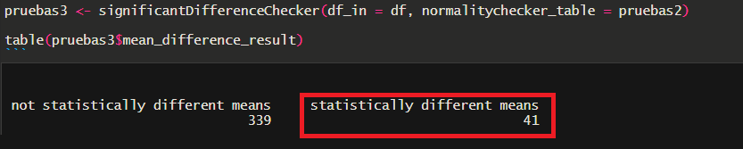

Encontramos **41 variables** con el promedio significativamente diferente entre los grupos de máquinas buenas y máquinas malas.

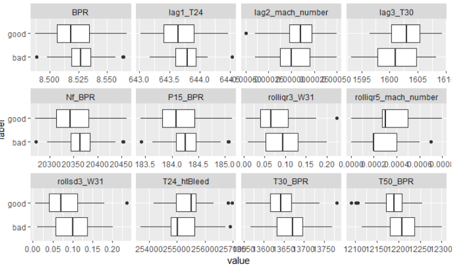

Ahora vamos a estudiar el problema de multicolinealidad o de cuando dos variables son altamente correlacionadas, al punto de ser una combinación lineal. Además, examinaremos si la correlación es significativamente diferente de cero. Usaremos la prueba de Spearman porque gran parte de las variables no son normalmente distribuídas.

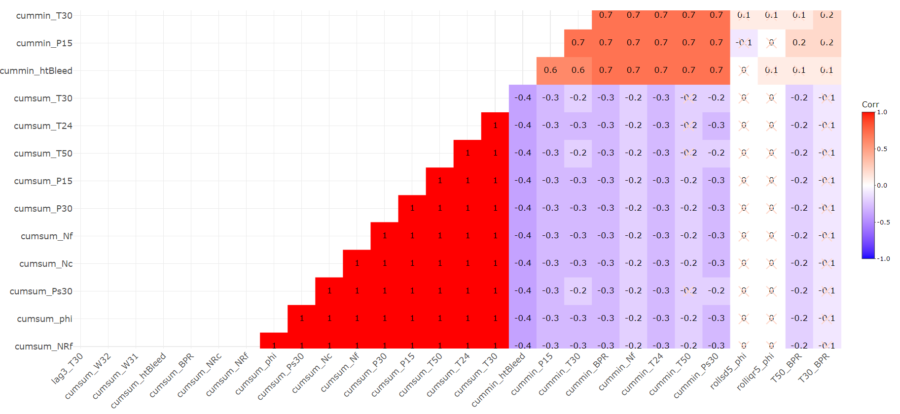

El resultado indica que hay muchas correlaciones que no son estadísticamente diferente de cero y, por otro lado, algunas variables son combinación lineales. Este última condición sería un problema en un modelo de regresión lineal. Una posible solución sería aplicar PCA en estas variables altamente correlacionadas.

Por fin, implementamos modelos de regresión logística y usamos el criterio de AIC para elegir el modelo con la mejor capacidad predictiva.
Las variables más importantes para explicar si una máquina tiene buen o malo rendimiento son:

* T30_BPR
* lag2_mach_number
* lag3_T30
* rollsd3_W31
* rolliqr3_W31
* rollsd5_Nf
* rollsd5_phi
* cummin_T30
* cummax_phi
* cummin_htBleed

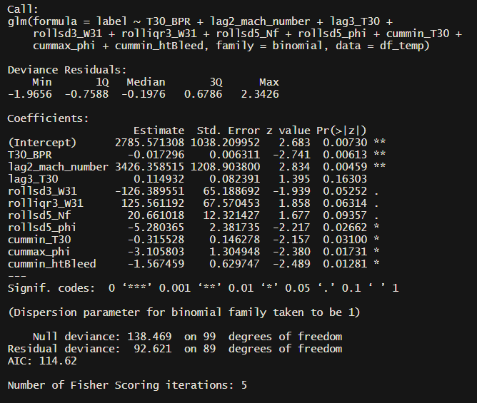

5 - Resultados
============

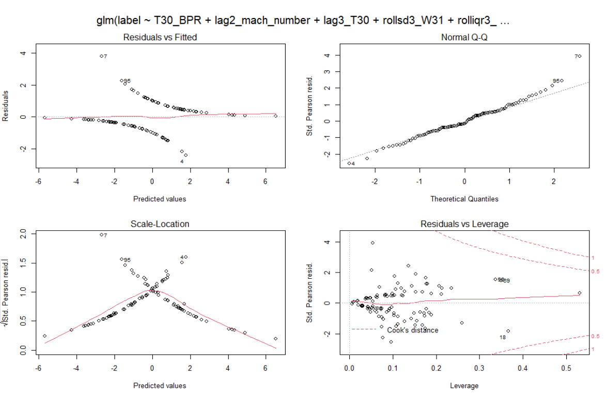

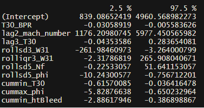

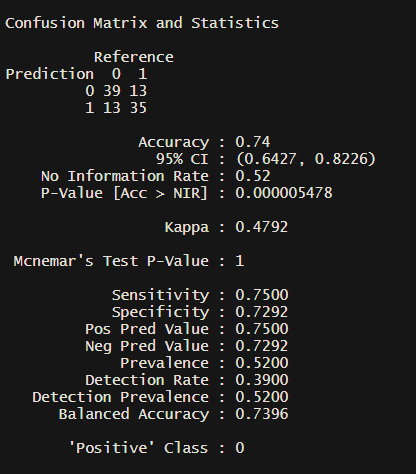

6 - Resolución del problema
============

Nuestra conclusión es que la información contenida en las variables:
lag2_mach_number 
lag3_T30           
rollsd3_W31      
rolliqr3_W31       
rollsd5_Nf        
rollsd5_phi       
cummin_T30        
cummax_phi         
cummin_htBleed 

Consigue explicar un 75% sobre cuando una máquina tendrá una vida larga o corta.
Nuestro sample size es de 100 máquinas, nuestro modelo es lineal y predecimos sobre el mismo dato usado en el entrenamiento, lo que puede causar overfitting (parcialmente ignorado porque regresión logistica es bastante limitada en generar overfitting).

Este resultado no responde realmente el problema sobre los factores que determinan una vida larga en las máquinas, pero sirve para indicar factores importantes que pueden ser explorados con nuevas variables, modelos más potentes y diferentes "problem framings".

Futuramente continuaremos esta investigación con los otros datasets y tres "problem framings" distintos:

* (1) Como un problema de clasificación para predecir el riesgo de la máquina fallar en su siguiente ciclo;

* (2) Un análisis de supervivencia;

* (3) Un modelos de regresión para prededir el **Remaining Useful Life** 
